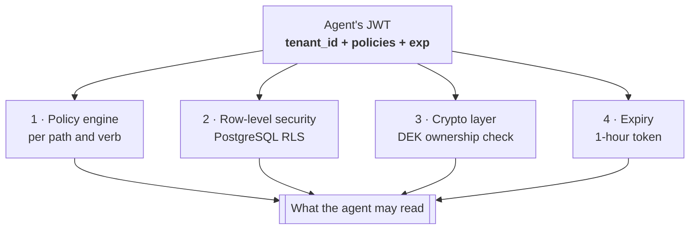

# Agentic AI secret management

How an AI agent gets a secret out of wslvault, what stops it getting one it
should not have, and where the sharp edges are.

Companion to [`tenant-authentication.md`](tenant-authentication.md).

---

## 1. The surface an agent talks to

`mcp-server` implements the **Model Context Protocol**, so an agent uses
wslvault the same way it uses any other MCP tool server — no vault-specific
client, no SDK.

| Transport | Endpoint |
|---|---|
| JSON-RPC (spec) | `POST /v1/mcp` |
| REST (legacy) | `GET /v1/mcp/tools`, `POST /v1/mcp/tools/call` |
| stdio | local/dev only |

### Tools

| Tool | Does |
|---|---|
| `read_secret` | read a secret at a path |
| `write_secret` | create or update one |
| `list_secrets` | list under a prefix |
| `delete_secret` | soft-delete a version |
| `destroy_secret_version` | irreversibly destroy one |
| `encrypt_data` / `decrypt_data` | encryption-as-a-service; the agent never handles a key |
| `rotate_transit_key` | rotate a transit key |
| `list_leases` / `revoke_lease` | inspect and revoke dynamic credentials |

`encrypt_data` / `decrypt_data` matter most for agents: the agent can protect
data without ever holding key material, so a leaked agent transcript leaks
ciphertext rather than a key.

---

## 2. How a request is authorised

```mermaid
sequenceDiagram
    autonumber
    actor A as AI agent
    participant M as mcp-server
    participant S as secret-engine
    participant P as policy-engine
    participant C as crypto-service

    A->>M: POST /v1/mcp  tools/call read_secret<br/>Authorization: Bearer <JWT>
    Note over M: presence-checks the header;<br/>does NOT verify the signature
    M->>S: GET /v1/secret/data/…<br/>X-Vault-Token: <JWT>
    Note over S: verifies HS256 + exp,<br/>takes tenant_id from the CLAIM
    S->>P: authorize(tenant, policies, path)
    P-->>S: allow / deny
    S->>C: decrypt(tenant_id, dek_id)
    Note over C: refuses if the DEK<br/>belongs to another tenant
    C-->>S: plaintext
    S-->>M: secret
    M-->>A: tool result
```

The agent's own JWT is what authorises the operation. `mcp-server` forwards it
and **does not** make trust decisions of its own — deliberately, because it sits
on the public Ingress and is the least trustworthy hop in the chain.

**The tenant comes from the verified token claim, never from the tool
arguments.** `tenant_id` appears in the tool schema for routing and audit, but
it does not grant anything: a token for tenant A cannot read tenant B by asking
for it.

---

## 3. What stops a rogue or compromised agent

Four layers, each independent:



1. **Policy** — least privilege per path and verb. An agent that only reads
   `apps/myservice/*` cannot read `apps/other/*`, whatever it asks for.
2. **RLS** — a query that forgets its tenant filter still returns nothing
   belonging to another tenant.
3. **Crypto** — `crypto-service` refuses a DEK belonging to another tenant, so
   even a bug in the layers above cannot decrypt foreign data.
4. **Expiry** — the session token lives one hour. A transcript leaked tomorrow
   contains a dead credential.

Plus an audit event per tool call, tagged with tenant, principal and outcome.

---

## 4. Giving an agent credentials

```bash
# One API key per agent, scoped to one tenant, least privilege.
curl -s -X POST https://vault.workstation.co.uk/v1/api-keys \
  -H "Authorization: Bearer $ADMIN" -H 'Content-Type: application/json' \
  -d '{"name":"agent-billing-bot",
       "tenant_id":"<tenant>",
       "policies":["read-billing-secrets"]}' | jq -r .key
```

Then the agent exchanges it for a session token and calls `/v1/mcp` with that
token as `Authorization: Bearer …`.

**Rules that matter more for agents than for humans:**

- **One key per agent.** Revoking a misbehaving agent must not take down the
  rest.
- **Never give an agent `root` or `admin`.** An admin key can mint keys for
  *any* tenant — that is a tenant-isolation bypass handed over voluntarily.
- **Prefer `encrypt_data`/`decrypt_data` over `read_secret`** where the agent
  only needs to protect data, so no key or plaintext enters its context.
- **Assume the context window leaks.** Anything an agent reads may end up in a
  transcript, a log, or a model provider's infrastructure. Scope keys so that
  is survivable, and prefer short-lived leases.
- **Never let an agent reach `crypto-service` or `policy-engine` directly.**
  NetworkPolicy already prevents it; keep it that way.

---

## 5. Known limits

Be aware of these before pointing production agents at this:

- **`mcp-server` does not verify the token it forwards.** It checks one is
  present. Verification happens at `secret-engine`, which is the component that
  can do it properly. The consequence is that an invalid token produces a
  backend 403 rather than a clean 401 from the MCP layer.
- **`X-Policies` is forwarded from the inbound request.** It is advisory:
  `secret-engine` re-derives policies from the verified token, so a caller
  inflating this header gains nothing. It is still worth stripping at the edge.
- **Header-asserted identity is disabled by default.**
  `VAULT_TRUST_GATEWAY_HEADERS` exists for deployments that genuinely front
  every listener with an authenticating, header-scrubbing proxy. Turning it on
  without such a proxy re-opens unauthenticated tenant impersonation.
- **API keys do not replicate between regions.** An agent pinned to a region
  needs a key minted in that region.
- **Cross-region reads do not work yet** — see
  [`ha-two-region.md`](ha-two-region.md) "Known limits".
