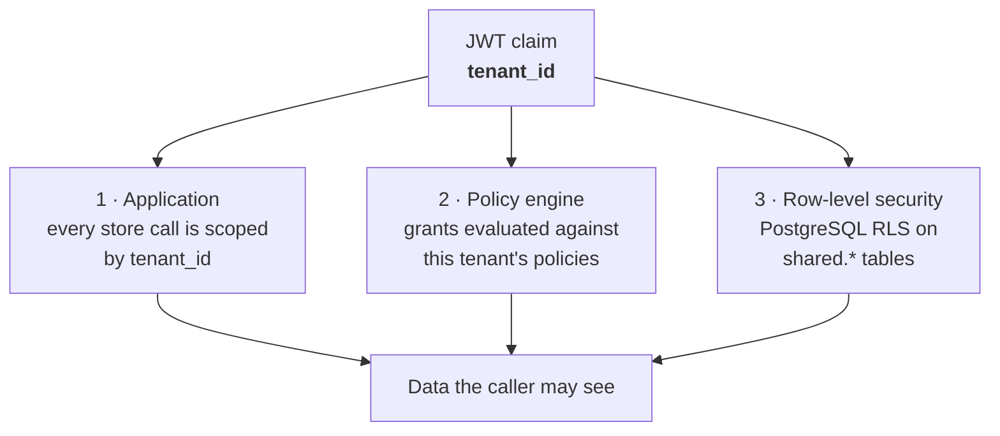

# Tenant authentication and session handling

How a caller proves who they are, how tenants stay isolated from one another,
and what protects a credential at each hop.

Companion to [`operations/obtaining-credentials.md`](operations/obtaining-credentials.md),
which covers the mechanics of getting a key.

---

## 1. The two-stage exchange

Nothing long-lived is sent on every request. A durable API key is exchanged
**once** for a short-lived session token, and only that token travels afterwards.

```mermaid
sequenceDiagram
    autonumber
    actor U as Operator / client
    participant UI as vault-ui
    participant ID as identity-service
    participant DB as PostgreSQL<br/>shared.api_keys
    participant SE as secret-engine
    participant PE as policy-engine

    Note over U,ID: Stage 1 — exchange the durable credential, once
    U->>UI: paste wslv_… API key
    UI->>ID: POST /v1/auth/api-key
    ID->>ID: SHA-256(raw key)
    ID->>DB: look up by hash (never by raw key)
    DB-->>ID: tenant_id, policies, revoked_at
    ID-->>UI: JWT (HS256) — tenant_id, policies, exp = now + 1h
    UI->>UI: store token; the raw key is discarded

    Note over U,PE: Stage 2 — every later call carries only the token
    U->>UI: open a page
    UI->>SE: GET /v1/kv/data/… + token
    SE->>SE: verify signature and exp with the shared JWT secret
    SE->>PE: authorize(tenant_id, policies, path)
    PE-->>SE: allow / deny
    SE-->>UI: 200 with data, or 403
```

**Why two stages.** The API key is the thing a human holds and can leak; it
crosses the wire once. The session token is what flows continuously, expires in
an hour, and carries no secret beyond its own signature.

---

## 2. What each credential is

| | API key | Session token |
|---|---|---|
| Form | `wslv_` + 32 random bytes, base64url | JWT, HS256 |
| Stored as | **SHA-256 hash only** | not stored — self-contained |
| Lifetime | until revoked | **1 hour** (`API_KEY_JWT_TTL_SECONDS`) |
| Carries | nothing — an opaque lookup handle | `tenant_id`, `policies`, `exp`, `iss`, `aud` |
| If leaked | full access until revoked | full access until it expires |
| Recoverable | no — shown once | re-issue by logging in again |

The raw key is generated once and returned once. Only its hash is persisted, so
the server cannot reveal a key even under compulsion — a lost key is re-minted,
never recovered.

The first 8 characters after `wslv_` are kept in clear as `key_prefix`,
deliberately: it lets a key be named in a log line, a ticket or a list without
exposing the secret.

---

## 3. How tenants stay separated

Isolation is enforced in three independent places, so a mistake in one does not
open the others:



1. **Application scoping** — queries filter on `tenant_id`; it comes from the
   verified token, never from a request parameter a caller could set.
2. **Policy evaluation** — `policy-engine` decides per path and verb from the
   `policies` claim bound at issuance.
3. **Row-level security** — `004_multitenancy.sql` enables RLS on
   `shared.secrets`, `secret_versions`, `leases`, `policies`, `audit_events`
   and `principals`, so a query that forgets its `WHERE` clause still returns
   nothing belonging to another tenant.

Tenant identity is **only ever** taken from the verified token. There is no
header, query parameter or body field that can select a tenant.

---

## 4. What protects a credential at each hop

| Hop | Protection |
|---|---|
| Browser → PoP | TLS (Let's Encrypt, terminated at the edge) |
| PoP → region edge | HTTP inside the operator's network; the PoP holds the public certificate |
| Ingress → service | in-cluster, constrained by default-deny NetworkPolicies |
| Service → service | in-cluster gRPC/HTTP, NetworkPolicy per pair |
| At rest | API keys as SHA-256 hashes; secrets encrypted with per-tenant DEKs |
| In the browser | `localStorage`, cleared on logout and on expiry |

### The browser is the weakest hop, by design

The session token lives in `localStorage`. That is readable by any script on the
origin, so a successful XSS steals the session. The mitigation is the **1-hour
expiry** and that the durable API key is never stored — only the token is.

`AuthContext.tsx` is explicit that `vault_policies` is a convenience for
rendering, not a control: the UI hides what the policies say to hide, but the
**server** decides. Editing that value in devtools changes the menu, not the
answer.

### Session clearing is all-or-nothing

`clearStoredSession()` removes `vault_token`, `vault_tenant_id`,
`vault_policies` and `vault_expires_at` together. A partial clear would leave a
half-session — a tenant id with no token, or policies from a previous login —
which is worse than none.

---

## 5. Administrative access

Two ways to reach the admin endpoints:

- **A JWT holding the admin policy** — `VAULT_ADMIN_POLICY`, default `admin`.
  This is the normal path; the credential expires and is attributable.
- **`VAULT_ADMIN_TOKEN`** — a static bootstrap secret for creating the first key
  of a fresh deployment. It does not expire and is not attributable to anyone.
  **Remove it once the first key exists.**

---

## 6. Multi-region caveats

The regions are an active/active pair, but authentication state is **not**
uniform across them:

| | Replicates? |
|---|---|
| API keys | **No** — a key minted in region A returns `key_not_found` in region B |
| Session tokens | **Yes, in effect** — signed with the shared mesh JWT secret, so either region verifies either token |
| Secret rows | Yes — via the replication outbox |
| Encryption keys (DEKs) | **No** — see below |

Two consequences worth planning around:

- **Mint an API key per region**, or accept that a failover invalidates logins.
- **A replicated secret cannot currently be read in the peer region.** The row
  arrives, but the DEK that encrypts it does not, so the read fails with
  `decryption failed: key not found`. Cross-region reads of the *same* secret
  are not yet usable; see `docs/ha-two-region.md`.

All regions share one JWT secret, root key and PKI root key, delivered by
`scripts/wslvault-mesh-keys.sh`. Divergence there breaks token verification and
makes replicated ciphertext undecryptable, so the script's `verify` subcommand
compares fingerprints across every region without printing key material.

---

## 7. Practical rules

- One API key per consumer, so revoking one does not take the others down.
- Rotate anything pasted into a chat, a ticket, or a history-writing shell.
- Never log a raw key; quote the `key_prefix` instead.
- Treat a session token as a bearer credential for its full hour — expiry is the
  only thing that ends it. There is no server-side revocation of an issued
  token today.
